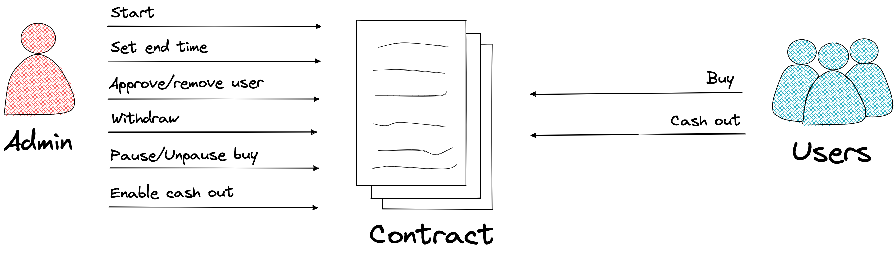

# Bond contract

This is a contract that allows the management and purchase of a bond represented by an ERC20 token.

There are two types of users: the Admin, who manages the contract, and the Users, who can buy the bonds and cash out when allowed. The main functions of each user are shown below.

## States

The functions can be called according to the current state that the contract is in. The possible states are:

- **Not Initiated**: The contract has not been initialized and is not ready to be used. The only function that can be called is `initialize`.
- **Initiated**: The contract has been initialized, but users cannot buy bonds yet. The only functions that can be called are `start` and the independent functions*.
- **Available**: The contract is available and allowed users can buy bonds. The admin also can also withdraw the money available in the contract, pause purchases, set the revaluation end date, and enable the cash out. The functions that can be called are `set_end` , `withdraw`, `pause`, `en_csh_out`, `buy`, and the independent functions*.
- **Paused**: The contract is paused for purchases. The functions that can be called are `unpause`, `withdraw`, `en_csh_out`, and the independent functions*.
- **Cash Out Enabled**: Users can exchange their bonds for their money with interest. The only functions that can be called are `cash_out` and the independent functions*.

*Independent functions: `add_user`, `rm_user`, `get_price`, `bond_id`

## Methods

Each method of the contract will be described as follows.

### `initialize`

This method is used to set the initial settings of the contract. Can be called by anyone and must be called before all other functions and only once. 

The bond token is issued with an ERC20 contract where the current contract is the administrator.

Params:

- `admin`: Identifier of the contract administrator.
- `payment_token_id`: Contract address of the token that will be used as payment/bond exchange. Must be in ERC20 standard.
- `bond_token_name`: Name of the token that will represent the bond.
- `bond_token_symbol`: Symbol of the token that will represent the bond.
- `bond_token_decimals`: Decimals of the token that will represent the bond.
- `price`: Bond starting price.
- `fee_rate`: Bond valuation rate. Needs to be multiplied by 1000 (this strategy is used to avoid data loss due to missing decimal number in Soroban). Example:
    - 10% ⇒ 0.1 ⇒ `fee_rate` must be 0.1 * 1000 = 100
- `fee_days_interval`: Interval in days of the bond's valuation.
- `fee_type`: Defines if the type of interest applied will be simple or compound.
- `initial_amount`: Amount of bond tokens to be minted.

### `add_user`

Adds a user to the whitelist, allowing him to buy bonds. Can only be called by the admin.

Params:

- `user`: Identifier of the user.

### `rm_user`

Removes a user from the whitelist, not allowing him to buy any more bonds. Can only be called by the admin.

Params:

- `user`: Identifier of the user.

### `bond_id`

Returns the contract address of the bond token.

### `get_price`

Returns the current bond price (starting price + fees).

### `start`

Changes the current state to Available and sets the initial date on which the bond interest will begin. Can only be called by the admin.

Params:

- `initial_timestamp`: Initial valuation date of the bond.

### `set_end`

Sets the end date on which the bond interests stop being applied. The end date must be greater than the initial date. Can only be called by the admin.

Params:

- `end_timestamp`: Final valuation date of the bond.

### `pause`

Changes the current state to Paused and prevents the `buy` function from being called. Can only be called by the admin.

### `unpause`

Changes the current state from Paused to Available. Can only be called by the admin.

### `buy`

User buys an amount of bond tokens at the current price (starting price + fees). The bond tokens are transferred from the contract to the user's account, and the amount in payment tokens is transferred from the user account to the contract*.

Only users present on the whitelist can call this method.

*This transfer is done using the `xfer_from` function of the ERC20 standard. Therefore, the user must have previously authorized the contract to manage this value.

Params:

- `amount`: Amount of bond tokens

### `withdraw`

The admin can withdraw all or part of the payment tokens from the contract balance. Cannot be called if cash out has already been enabled. Can only be called by the admin.

Params:

- `amount`: Amount of payment tokens to withdraw

### `en_csh_out`

Enables the cash out of payment tokens. The end time must have passed and the contract must have a balance of payment tokens greater than or equal to the amount needed to pay the users. Can only be called by the admin.

### `cash_out`

Transfer the amount of payment tokens relative to the user bond tokens balance, with the final valuation value. The user bond tokens are burned. Can only be called if cash out is enabled.

## Bond price

The bond starts with an initial price, and from the initial time an interest rate starts to be applied to its value. So if a bond starts at price X, and a user wants to buy it 3 months after the initial time, he will pay X + fees for 3 months. 

When cash out is enabled, users can cash out the payment tokens from the valued bond. The sooner a user buys, the more profit he will make.

The interest rate type (simple or compound), the time interval that rate will be applied, the rate value and the initial bond price are set at initialization.
