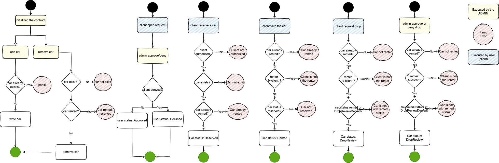

# Smart contract example for car rental


This project is an example how to build a rust smart contract and deploy it on soroban

The folder structure is: 
- /aux: rust projects to use as support functions
    - car_byte_converter: converts the bytes to char values
    - convert_public_key_ed: convert public keys to ed format
    - hex_convert: convert data string to hex values

- /car_rental: the smart contract structure itself
    - /src
        - contract_trait.rs : the trait of implementation of the contract.
        - contract.rs: the contract fn implementations
        - errors.rs: the enum that represent the errors
        - lib.rs: imports 
        - metadata.rs: all write and read to the contract storage
        - storage_types.rs: types of data
        - test: tests of the contract implementations
        - testutils.rs: helpers of the tests
        

## How to execute
    1. run soroban in localhost: https://soroban.stellar.org/docs/tutorials/deploy-to-local-network
 ````   
    docker run --rm -it \
  --platform linux/amd64 \
  -p 8000:8000 \
  --name stellar \
  stellar/quickstart:soroban-dev@sha256:0993d3350148af6ffeab5dc8f0b835236b28dade6dcae77ff8a09317162f768d \
  --standalone \
  --enable-soroban-rpc
  ````

    2. All the executions and invokes to soroban network and contract are inside make file. The next steps are executed using makefile.
    3. Complete the .env
    4. Execute "make friendbot_local" to fund a Soroban network account
    5. Build the contract with "make build_contract"
    6. Deploy the contract in soroban with "make deploy". This will generate a contract id inside .env
    7. Initialized the contract with "make init" to set the contract admin
    8. Use one of the make commands to execute the functions from the contract:
        - make add_car: add car to contract (ADMIN).
            ex: make add_car PLATE=iyd1010 MODEL=Gol Color=Blue HORSE=72
        - make remove_car: remove car to contract (ADMIN).
            ex: make remove_car PLATE=iyd1010
        - make read_car: read the car data.
            ex: make read_car PLATE=iyd1010
        - make open_req: open request to be allowed to reserve a car.
            ex: make open_req
        - make approve_req: aprove client to reserve a car (ADMIN).
            ex: make approve_req
        - make deny_req: deny client to reserve a car (ADMIN).
            ex: make deny_req
        - make read_client: read the client status.
            ex: make read_client
        - make reserve_car: client reserve a car.
            ex: make reserve_car PLATE=iyd1010
        - make read_rent: read rent status.
            ex: make read_rent PLATE=iyd1010
        - make take_car: client take a car (previous reserved).
            ex: make take_car PLATE=iyd1010
        - make deny_drop: deny  client drop the car (ADMIN).
            ex: make deny_drop PLATE=iyd1010
        - make accept_drop: accept client drop the car (ADMIN). 
            ex: make accept_drop PLATE=iyd1010
        Remove from rent.

        
## Documentation

[Extra documentation](https://cheesecakelabs.atlassian.net/wiki/spaces/TTO/pages/2865266803/Soroban)


    
## Authors

- [@alessandrak](https://github.com/alessandrak)
- [@webererico](https://github.com/webererico)
- [@wjuniorbh92](https://github.com/wjuniorbh92)


