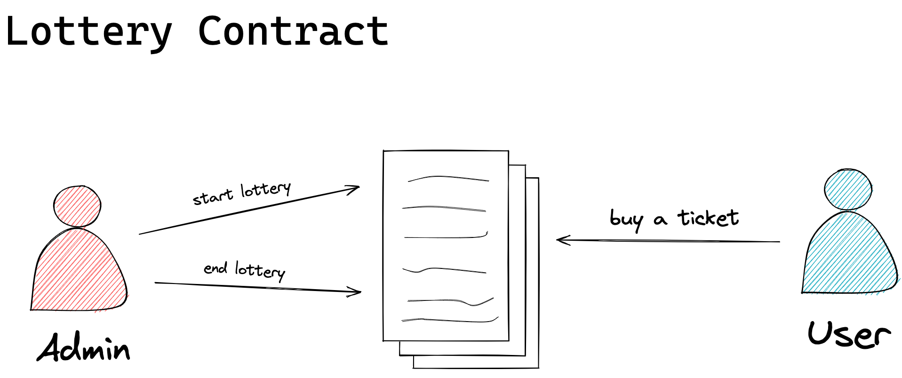

# Soroban Hackathon Lottery

The goal of this hackathon was to create a lottery system where:

- The administrator can set a commission for themselves.
- The winner is chosen based on a random memory address minus the number of participating users and multiplied by the ledger timestamp. From the resulting amount, the mod is calculated by the number of users. Thus, the winner's index is found.
- the winner takes it all.

## Methods

Each method of the contract will be described as follows.

### `initialize`

This method is used to set the initial settings of the contract. Can be called by anyone and must be called before all other functions and only once.

Params:

- `admin`: Identifier of the contract administrator.
- `token_address`: Contract address of the token that will be used as payment.
- `price`: Ticket price.
- `gain_percentage`: Percentage of the final prize that the admin will receive

### `start`

Starts the lottery and allows the users to buy tickets. Must be called by the admin.

### `buy_ticket`

Buy a lottery ticket. The ticket price is transferred from the user's account to the contract and the user is saved on DataKey.

### `end`

Ends the lottery and selects a winner. The prize amount is divided and transferred from the contract account to the winning user and the admin. Must be called by the admin.

