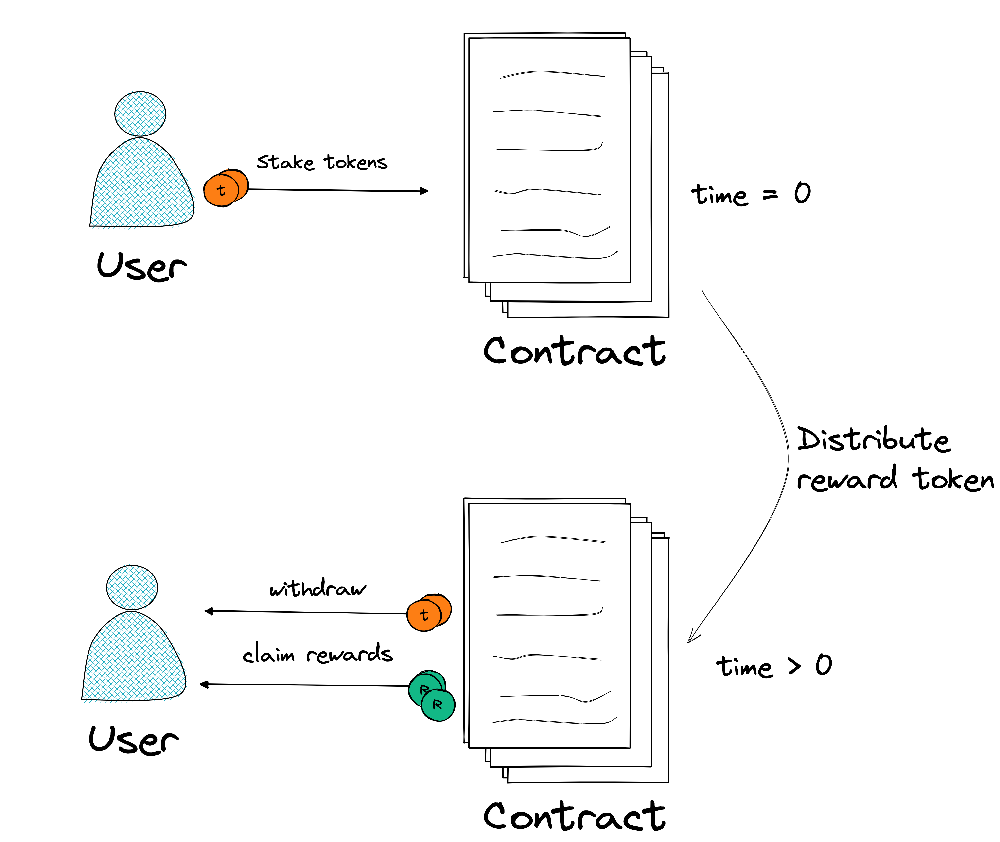
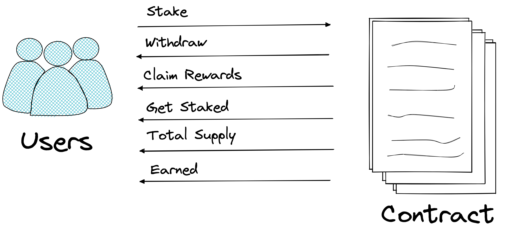

# Staking contract

This is a contract that allows users to stake tokens inside a contract and earn reward tokens.

There is only one type of user, who needs to approve the contract to stake the token. The user earns some fee based on the time staked. This fee is paid with a reward token, so the contract must have the amount of this reward token to be paid.

The staking token and the reward token are represented by an ERC20 token.

The basic flow of use of the contract is illustrated below.

## Methods

Each method of the contract will be described as follows.

### `initialize`

This method is use to set the initial settings of the contract. Can be called by anyone and must be call before all other functions and only once. This method will define what is the staking token, the reward token and the reward rate to be paid.

The reward token is issued with an ERC20 contract where the current contract is the administrator.

Params:

- `staking_token_id`: Contract address of the token that will be using to stake. Must be in ERC20 standard.
- `rewards_token_id`: Contract address of the token that will be using as rewards. Must be in ERC20 standard.
- `rate`: The reward rate distributed to users per second.

### `stake`

The User deposit some stake tokens in the contract. (user sends to contract)

Pre-Conditions:

The user needs to approve the contract to stake the token.

Params:

- `amount`: The amount of the stake token

### `withdraw`

The User can request to withdraw some stake token amount. (contract send to a user)

Params:

- `amount`: The amount of stake tokens to be withdrawn

### `claim_rwrd`

Returns to the user address the total amount of rewards token earned. (contract send to a user)

### `earned`

Returns the amount of the user rewards earned.

### `get_staked`

Return the amount of stake token the user has inside the contract.

### `tot_supply`

Return the total supply of stake tokens inside the contract. (sum of all user stake tokens)

## Rewards per token

The rewards per token are refreshed each time users interact with the contract.

It is calculated according to the total stake token supply, the amount of reward tokens stored, and the timestamp of the contract.

The reward rate defines how many reward tokens will are distributed per stake token.
